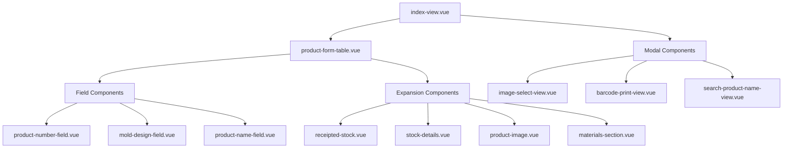

# New GR Production Module

## Overview

The `new-gr-production` module is a refactored and enhanced version of the original `gr-production` module. It maintains all original functionality while providing better code organization, improved maintainability, and component separation.

## 📁 Folder Structure

```
new-gr-production/
├── index-view.vue                      # Main entry component
├── components/
│   ├── production-header-view.vue      # Production header display
│   ├── product-form-table.vue          # Main form table component
│   ├── table-footer.vue                # Table footer with actions
│   ├── fields/                         # Form field components
│   │   ├── product-number-field.vue    # Product number input
│   │   ├── mold-design-field.vue       # Mold design input
│   │   └── product-name-field.vue      # Product name with search
│   ├── expansion/                      # Row expansion components
│   │   ├── receipted-stock.vue         # Already receipted items
│   │   ├── stock-details.vue           # Stock form details
│   │   ├── product-image.vue           # Image selection/preview
│   │   └── materials-section.vue       # Materials management
│   ├── customise-view.vue              # Customization component
│   └── barcode-demo-view.vue           # Barcode preview
└── modal/
    ├── image-select-view.vue           # Image selection modal
    ├── barcode-print-view.vue          # Barcode printing modal
    └── search-product-name-view.vue    # Product name search modal
```

## 🎯 Key Components

### 1. Main Components

#### `index-view.vue`
- **Purpose**: Main entry point and data coordinator
- **Features**:
  - Manages global state and API calls
  - Coordinates between header, form table, and modals
  - Handles business logic and validation
  - Maintains backward compatibility with original functionality

#### `product-form-table.vue`
- **Purpose**: Main data table with form capabilities
- **Features**:
  - Renders product data in expandable table format
  - Manages row selection and validation
  - Delegates field rendering to specialized components
  - Handles table footer actions

### 2. Field Components

#### `product-number-field.vue`
- **Purpose**: Dedicated product number input
- **Props**: `data`, `getBgColor`, `isRequiredField`
- **Features**: Input validation and styling

#### `mold-design-field.vue`
- **Purpose**: Mold design input field
- **Props**: `data`, `getBgColor`, `isRequiredField`
- **Features**: Input validation and styling

#### `product-name-field.vue`
- **Purpose**: Product name input with search functionality
- **Props**: `data`, `language`, `getBgColor`, `isRequiredField`
- **Features**: 
  - Bilingual support (EN/TH)
  - Integrated search button
  - Input validation

### 3. Expansion Components

#### `receipted-stock.vue`
- **Purpose**: Display for already receipted stock items
- **Features**:
  - Read-only barcode display
  - Product image preview
  - Non-editable state presentation

#### `stock-details.vue`
- **Purpose**: Editable stock information form
- **Features**:
  - Quantity and price inputs
  - Size and stud earring selection
  - Location and remark fields
  - Form validation

#### `product-image.vue`
- **Purpose**: Product image management
- **Features**:
  - Image preview display
  - Image selection trigger
  - No-image placeholder

#### `materials-section.vue`
- **Purpose**: Complex materials management
- **Features**:
  - Dynamic material addition/removal
  - Material type selection (Gold, Silver, Diamond, Gem)
  - Quantity, weight, and price inputs
  - Barcode generation integration

### 4. Utility Components

#### `table-footer.vue`
- **Purpose**: Table action controls
- **Features**:
  - Selected items counter
  - Draft save functionality
  - Submit button with validation

## 🔄 Data Flow



## 🛠️ Technical Features

### State Management
- **Centralized State**: Main component manages all data
- **Event-Driven Updates**: Child components emit events for data changes
- **Reactive Updates**: Vue reactivity ensures UI consistency

### Form Validation
- **Field-Level Validation**: Individual field validation rules
- **Form-Level Validation**: Complete form validation before submission
- **Visual Feedback**: Color-coded fields based on validation state

### Barcode Integration
- **Dynamic Generation**: Real-time barcode updates based on materials
- **Multiple Formats**: Support for different product types
- **Preview Integration**: Live barcode preview in expansion rows

### Material Management
- **Dynamic Adding**: Add materials on demand
- **Type-Specific Fields**: Different input fields based on material type
- **Barcode Integration**: Automatic barcode text generation

## 🔧 Props and Events

### Common Props Pattern
```typescript
interface CommonFieldProps {
  data: Object          // The data object being edited
  getBgColor: Function  // Function for dynamic styling
  isRequiredField: Function // Validation function
}
```

### Event Patterns
```typescript
// Field update events
$emit('update', fieldName: string, value: any)

// Action events
$emit('search', data: Object, type: string)
$emit('selectImage', data: Object)
$emit('addMaterial', materials: Array)
$emit('removeMaterial', material: Object, item: Object, index: number)
```

## 📊 Master Data Integration

### Required Master Data
- **Gold Types**: `masterGold` - Gold/Silver type definitions
- **Gem Types**: `masterGem` - Gemstone type definitions
- **Diamond Grades**: `masterDiamondGrade` - Diamond quality grades
- **Stud Types**: `masterStud` - Earring stud options
- **Material Types**: `masterMaterialType` - Material category definitions

### API Integration
- **Production Store**: `useReceiptProductionApiStore`
- **Master Store**: `useMasterApiStore`
- **Image API**: Direct API calls for image operations

## 🎨 Styling

### SCSS Organization
- **Standard Form**: Imports from `@/assets/scss/custom-style/standard-form`
- **Component-Specific**: Each component has scoped styles
- **Consistent Theming**: Uses CSS custom properties for colors

### Key Style Classes
- `.custom-form-table`: Main table styling with selection states
- `.filter-container-img`: Image preview container
- `.form-col-container`: Flexible column layouts
- `.filter-container-bg-focus`: Highlighted sections

## 🔄 Migration from Original

### Backward Compatibility
- ✅ All original functionality preserved
- ✅ Same API endpoints and data structure
- ✅ Identical business logic and validation
- ✅ Same user interface behavior

### Improvements
- 🎯 **Component Separation**: Smaller, focused components
- 🔧 **Better Maintainability**: Easier to debug and modify
- 🚀 **Enhanced Reusability**: Components can be used elsewhere
- 📖 **Improved Readability**: Cleaner template structure
- 🧪 **Better Testability**: Isolated component testing

## 🚀 Usage Example

```vue
<template>
  <div class="app-container">
    <!-- Simple, clean template -->
    <headerView
      :model="data"
      :modelHeader="header"
      :modelGem="gems"
      @onFetch="onFetch"
    />

    <div class="form-col-container mt-2">
      <form @submit.prevent="onSubmit">
        <ProductFormTable
          v-model:selectedItems="selectedItems"
          :form="form"
          :columns="columns"
          :masterGold="masterGold"
          :masterGem="masterGem"
          @searchProductName="onSearchProductName"
          @selectImage="onSelectImage"
        />
      </form>
    </div>

    <!-- Modal components -->
    <modalSelectImage />
    <modalBarcodePrint />
    <modalSearchProductName />
  </div>
</template>
```

## 🔍 Development Notes

### Adding New Fields
1. Create new field component in `components/fields/`
2. Add to `ProductFormTable` template
3. Handle events in parent component

### Extending Materials
1. Add new material type to `masterMaterialType`
2. Update `materials-section.vue` template logic
3. Extend barcode generation in parent component

### Custom Validation
1. Add validation rules to parent component
2. Pass validation functions as props
3. Handle validation feedback in field components

## 📈 Performance Considerations

### Optimization Features
- **Lazy Loading**: Async component imports where beneficial
- **Event Debouncing**: Prevent excessive API calls
- **Computed Properties**: Efficient reactive calculations
- **Scoped Slots**: Efficient template rendering

### Memory Management
- **Component Cleanup**: Proper event listener cleanup
- **Reactive References**: Careful use of reactive data
- **Image Handling**: Efficient image loading and caching

## 🐛 Troubleshooting

### Common Issues
1. **Props Mutation Warnings**: Components should emit events instead of directly modifying props
2. **Validation Issues**: Ensure all required master data is loaded
3. **Barcode Generation**: Check material data structure and types

### Debug Tips
- Use Vue DevTools for component inspection
- Check console for validation errors
- Verify API responses in Network tab
- Test individual components in isolation

---

**Last Updated**: December 2024  
**Version**: 1.0.0  
**Compatibility**: Vue 3 + Composition API