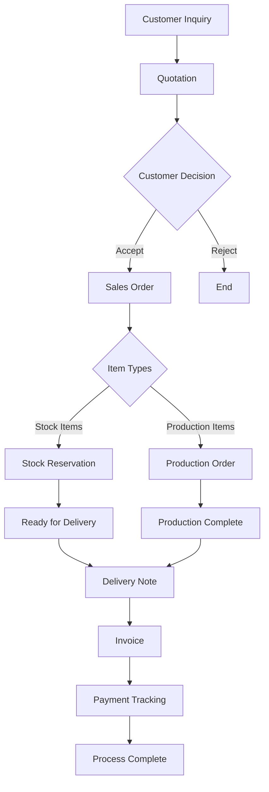

# Sales Flow Navigation Structure

โครงสร้างเมนูและการนำทางสำหรับระบบงานขายครบวงจร

## ภาพรวม Sales Flow



## เมนูโครงสร้างใหม่ (Proposed)

### 📋 งานขาย (Sales Management)

```
งานขาย (Sales)
├── 📊 ภาพรวมงานขาย (Sales Dashboard)
├── 💰 ใบเสนอราคา (Quotations)
│   ├── สร้างใบเสนอราคา
│   └── รายการใบเสนอราคา  ✅
├── 📦 ใบสั่งขาย (Sales Orders)
│   ├── สร้างใบสั่งขาย     ✅
│   └── รายการใบสั่งขาย
├── 🔧 การผลิต (Production)
│   ├── ใบสั่งผลิต         ✅
│   └── ติดตามการผลิต
├── 📋 การจัดการสต็อก (Stock Management)
│   ├── จองสต็อก          ✅
│   └── ปล่อยสต็อก
├── 🚚 การส่งมอบ (Delivery)
│   ├── ใบส่งของ          ✅
│   └── ติดตามการส่งมอบ
├── 📄 ใบแจ้งหนี้ (Invoicing)
│   ├── สร้างใบแจ้งหนี้     ✅
│   └── รายการใบแจ้งหนี้
└── 💳 การชำระเงิน (Payment)
    ├── ภาพรวมการชำระเงิน   ✅
    ├── บันทึกการรับชำระ
    └── ติดตามหนี้ค้างชำระ
```

## Router Configuration

### Route Structure
```javascript
// src/router/web/sale/sale-routes.js
export default [
  {
    path: '/sale',
    name: 'sale',
    component: () => import('@/layout/DashboardLayout.vue'),
    redirect: '/sale/dashboard',
    meta: {
      Displayname: { th: 'งานขาย', en: 'Sales' },
      permissions: [PERMISSIONS.SALE_VIEW]
    },
    children: [
      // Dashboard
      {
        path: 'dashboard',
        name: 'sale-dashboard',
        component: () => import('@/views/sale/dashboard/index-view.vue'),
        meta: {
          Displayname: { th: 'ภาพรวมงานขาย', en: 'Sales Dashboard' },
          permissions: [PERMISSIONS.SALE_DASHBOARD]
        }
      },
      
      // Quotations
      {
        path: 'quotation',
        name: 'sale-quotation',
        component: () => import('@/views/sale/quotation/index-view.vue'),
        meta: {
          Displayname: { th: 'สร้างใบเสนอราคา', en: 'Create Quotation' },
          permissions: [PERMISSIONS.QUOTATION_CREATE]
        }
      },
      {
        path: 'quotation-list',
        name: 'sale-quotation-list',
        component: () => import('@/views/sale/quotation-list/index-view.vue'),
        meta: {
          Displayname: { th: 'รายการใบเสนอราคา', en: 'Quotation List' },
          permissions: [PERMISSIONS.QUOTATION_VIEW]
        }
      },
      
      // Sales Orders
      {
        path: 'sale-order',
        name: 'sale-order',
        component: () => import('@/views/sale/sale-order/index-view.vue'),
        meta: {
          Displayname: { th: 'สร้างใบสั่งขาย', en: 'Create Sales Order' },
          permissions: [PERMISSIONS.SALE_ORDER_CREATE]
        }
      },
      {
        path: 'sale-order-list',
        name: 'sale-order-list',
        component: () => import('@/views/sale/sale-order-list/index-view.vue'),
        meta: {
          Displayname: { th: 'รายการใบสั่งขาย', en: 'Sales Order List' },
          permissions: [PERMISSIONS.SALE_ORDER_VIEW]
        }
      },
      
      // Production
      {
        path: 'production-order',
        name: 'sale-production-order',
        component: () => import('@/views/sale/production-order/index-view.vue'),
        meta: {
          Displayname: { th: 'ใบสั่งผลิต', en: 'Production Order' },
          permissions: [PERMISSIONS.PRODUCTION_ORDER]
        }
      },
      
      // Stock Management
      {
        path: 'stock-reservation',
        name: 'sale-stock-reservation',
        component: () => import('@/views/sale/stock-reservation/index-view.vue'),
        meta: {
          Displayname: { th: 'จองสต็อก', en: 'Stock Reservation' },
          permissions: [PERMISSIONS.STOCK_RESERVE]
        }
      },
      
      // Delivery
      {
        path: 'delivery-note',
        name: 'sale-delivery-note',
        component: () => import('@/views/sale/delivery-note/index-view.vue'),
        meta: {
          Displayname: { th: 'ใบส่งของ', en: 'Delivery Note' },
          permissions: [PERMISSIONS.DELIVERY_NOTE]
        }
      },
      
      // Invoicing
      {
        path: 'invoice',
        name: 'sale-invoice',
        component: () => import('@/views/sale/invoice/index-view.vue'),
        meta: {
          Displayname: { th: 'สร้างใบแจ้งหนี้', en: 'Create Invoice' },
          permissions: [PERMISSIONS.INVOICE_CREATE]
        }
      },
      
      // Payment Tracking
      {
        path: 'payment-dashboard',
        name: 'sale-payment-dashboard',
        component: () => import('@/views/sale/payment-tracking/dashboard/index-view.vue'),
        meta: {
          Displayname: { th: 'ภาพรวมการชำระเงิน', en: 'Payment Dashboard' },
          permissions: [PERMISSIONS.PAYMENT_VIEW]
        }
      },
      {
        path: 'payment-entry',
        name: 'sale-payment-entry',
        component: () => import('@/views/sale/payment-tracking/payment-entry/index-view.vue'),
        meta: {
          Displayname: { th: 'บันทึกการรับชำระ', en: 'Payment Entry' },
          permissions: [PERMISSIONS.PAYMENT_CREATE]
        }
      }
    ]
  }
]
```

## Permission Constants

### Permission Definitions
```javascript
// src/constants/permissions.js
export const PERMISSIONS = {
  // Sales Dashboard
  SALE_VIEW: 'SALE_VIEW',
  SALE_DASHBOARD: 'SALE_DASHBOARD',
  
  // Quotations
  QUOTATION_VIEW: 'QUOTATION_VIEW',
  QUOTATION_CREATE: 'QUOTATION_CREATE',
  QUOTATION_EDIT: 'QUOTATION_EDIT',
  QUOTATION_DELETE: 'QUOTATION_DELETE',
  
  // Sales Orders
  SALE_ORDER_VIEW: 'SALE_ORDER_VIEW',
  SALE_ORDER_CREATE: 'SALE_ORDER_CREATE',
  SALE_ORDER_EDIT: 'SALE_ORDER_EDIT',
  SALE_ORDER_DELETE: 'SALE_ORDER_DELETE',
  
  // Production
  PRODUCTION_ORDER: 'PRODUCTION_ORDER',
  PRODUCTION_TRACK: 'PRODUCTION_TRACK',
  
  // Stock
  STOCK_RESERVE: 'STOCK_RESERVE',
  STOCK_RELEASE: 'STOCK_RELEASE',
  
  // Delivery
  DELIVERY_NOTE: 'DELIVERY_NOTE',
  DELIVERY_TRACK: 'DELIVERY_TRACK',
  
  // Invoice
  INVOICE_VIEW: 'INVOICE_VIEW',
  INVOICE_CREATE: 'INVOICE_CREATE',
  INVOICE_SEND: 'INVOICE_SEND',
  
  // Payment
  PAYMENT_VIEW: 'PAYMENT_VIEW',
  PAYMENT_CREATE: 'PAYMENT_CREATE',
  PAYMENT_TRACK: 'PAYMENT_TRACK'
}
```

## Navigation Components

### Sales Menu Component
```vue
<!-- src/components/Navigation/SalesMenu.vue -->
<template>
  <div class="sales-menu">
    <div class="menu-section">
      <h6 class="menu-section-title">
        <i class="bi bi-graph-up mr-2"></i>
        ภาพรวม
      </h6>
      <router-link to="/sale/dashboard" class="menu-item">
        <i class="bi bi-speedometer2"></i>
        <span>ภาพรวมงานขาย</span>
      </router-link>
    </div>

    <div class="menu-section">
      <h6 class="menu-section-title">
        <i class="bi bi-file-text mr-2"></i>
        เอกสารขาย
      </h6>
      <router-link to="/sale/quotation" class="menu-item">
        <i class="bi bi-file-plus"></i>
        <span>สร้างใบเสนอราคา</span>
      </router-link>
      <router-link to="/sale/quotation-list" class="menu-item">
        <i class="bi bi-list-ul"></i>
        <span>รายการใบเสนอราคา</span>
      </router-link>
      <router-link to="/sale/sale-order" class="menu-item">
        <i class="bi bi-cart-plus"></i>
        <span>สร้างใบสั่งขาย</span>
      </router-link>
    </div>

    <div class="menu-section">
      <h6 class="menu-section-title">
        <i class="bi bi-gear mr-2"></i>
        การดำเนินการ
      </h6>
      <router-link to="/sale/production-order" class="menu-item">
        <i class="bi bi-tools"></i>
        <span>ใบสั่งผลิต</span>
      </router-link>
      <router-link to="/sale/stock-reservation" class="menu-item">
        <i class="bi bi-bookmark"></i>
        <span>จองสต็อก</span>
      </router-link>
      <router-link to="/sale/delivery-note" class="menu-item">
        <i class="bi bi-truck"></i>
        <span>ใบส่งของ</span>
      </router-link>
    </div>

    <div class="menu-section">
      <h6 class="menu-section-title">
        <i class="bi bi-credit-card mr-2"></i>
        การเงิน
      </h6>
      <router-link to="/sale/invoice" class="menu-item">
        <i class="bi bi-receipt"></i>
        <span>ใบแจ้งหนี้</span>
      </router-link>
      <router-link to="/sale/payment-dashboard" class="menu-item">
        <i class="bi bi-wallet2"></i>
        <span>ภาพรวมการชำระเงิน</span>
      </router-link>
      <router-link to="/sale/payment-entry" class="menu-item">
        <i class="bi bi-cash-coin"></i>
        <span>บันทึกการรับชำระ</span>
      </router-link>
    </div>
  </div>
</template>
```

## Breadcrumb Navigation

### Breadcrumb Component
```vue
<!-- src/components/Navigation/SalesBreadcrumb.vue -->
<template>
  <nav aria-label="breadcrumb">
    <ol class="breadcrumb">
      <li class="breadcrumb-item">
        <router-link to="/dashboard">
          <i class="bi bi-house"></i>
          หน้าหลัก
        </router-link>
      </li>
      <li class="breadcrumb-item">
        <router-link to="/sale/dashboard">งานขาย</router-link>
      </li>
      <li class="breadcrumb-item active" aria-current="page">
        {{ currentPageTitle }}
      </li>
    </ol>
  </nav>
</template>

<script>
export default {
  computed: {
    currentPageTitle() {
      return this.$route.meta?.Displayname?.th || 'ไม่ระบุ'
    }
  }
}
</script>
```

## Quick Actions

### Sales Quick Actions
```vue
<!-- src/components/QuickActions/SalesQuickActions.vue -->
<template>
  <div class="quick-actions">
    <h6>การดำเนินการด่วน</h6>
    <div class="action-grid">
      <div class="action-card" @click="createQuotation">
        <i class="bi bi-file-plus"></i>
        <span>สร้างใบเสนอราคา</span>
      </div>
      <div class="action-card" @click="createSaleOrder">
        <i class="bi bi-cart-plus"></i>
        <span>สร้างใบสั่งขาย</span>
      </div>
      <div class="action-card" @click="recordPayment">
        <i class="bi bi-cash-coin"></i>
        <span>บันทึกการรับชำระ</span>
      </div>
      <div class="action-card" @click="viewOverdue">
        <i class="bi bi-exclamation-triangle"></i>
        <span>ใบแจ้งหนี้เลยกำหนด</span>
      </div>
    </div>
  </div>
</template>
```

## Status Flow Indicators

### Process Status Component
```vue
<!-- src/components/Status/SalesProcessStatus.vue -->
<template>
  <div class="process-status">
    <div class="status-steps">
      <div 
        v-for="(step, index) in processSteps" 
        :key="index"
        :class="getStepClass(step, index)"
        class="status-step"
      >
        <div class="step-icon">
          <i :class="step.icon"></i>
        </div>
        <div class="step-label">{{ step.label }}</div>
      </div>
    </div>
  </div>
</template>

<script>
export default {
  props: {
    currentStep: { type: String, required: true }
  },
  
  data() {
    return {
      processSteps: [
        { key: 'quotation', label: 'ใบเสนอราคา', icon: 'bi bi-file-text' },
        { key: 'sale-order', label: 'ใบสั่งขาย', icon: 'bi bi-cart' },
        { key: 'production', label: 'การผลิต', icon: 'bi bi-tools' },
        { key: 'delivery', label: 'การส่งมอบ', icon: 'bi bi-truck' },
        { key: 'invoice', label: 'ใบแจ้งหนี้', icon: 'bi bi-receipt' },
        { key: 'payment', label: 'การชำระเงิน', icon: 'bi bi-wallet2' }
      ]
    }
  },
  
  methods: {
    getStepClass(step, index) {
      const currentIndex = this.processSteps.findIndex(s => s.key === this.currentStep)
      
      if (index < currentIndex) return 'step-completed'
      if (index === currentIndex) return 'step-current'
      return 'step-pending'
    }
  }
}
</script>
```

## Context Menu Actions

### Sales Context Menu
```javascript
// src/composables/useSalesContextMenu.js
export function useSalesContextMenu() {
  const getContextMenuItems = (type, item) => {
    const baseItems = [
      { label: 'ดูรายละเอียด', icon: 'bi bi-eye', action: 'view' },
      { label: 'แก้ไข', icon: 'bi bi-pencil', action: 'edit' }
    ]
    
    const typeSpecificItems = {
      quotation: [
        { label: 'สร้างใบสั่งขาย', icon: 'bi bi-cart-plus', action: 'create-sale-order' },
        { label: 'สร้าง PDF', icon: 'bi bi-file-pdf', action: 'generate-pdf' }
      ],
      saleOrder: [
        { label: 'สร้างใบสั่งผลิต', icon: 'bi bi-tools', action: 'create-production' },
        { label: 'จองสต็อก', icon: 'bi bi-bookmark', action: 'reserve-stock' }
      ],
      invoice: [
        { label: 'ส่งใบแจ้งหนี้', icon: 'bi bi-send', action: 'send-invoice' },
        { label: 'บันทึกการรับชำระ', icon: 'bi bi-cash', action: 'record-payment' }
      ]
    }
    
    return [...baseItems, ...(typeSpecificItems[type] || [])]
  }
  
  return { getContextMenuItems }
}
```

## Summary

### ✅ Completed Components
1. **Production Order System** - ใบสั่งผลิตจาก Sale Order
2. **Stock Reservation System** - ระบบจองสต็อกสินค้า  
3. **Delivery Note Framework** - โครงสร้างใบส่งของ
4. **Invoice System Framework** - โครงสร้างใบแจ้งหนี้
5. **Payment Tracking Spec** - รายละเอียดระบบติดตามการชำระ
6. **Navigation Structure** - โครงสร้างเมนูและการนำทาง

### 🔄 Ready for Development
- Router configuration
- Permission system
- Menu components  
- Breadcrumb navigation
- Quick actions
- Context menus
- Process status indicators

### 📋 Integration Checklist
- [ ] Update main router with sales routes
- [ ] Add permission constants
- [ ] Create navigation components
- [ ] Implement breadcrumb system
- [ ] Add quick action shortcuts
- [ ] Setup context menus
- [ ] Configure role-based access

---
*Sales Flow UI Design: Complete ✅*
*Ready for Demo & API Integration 🚀*